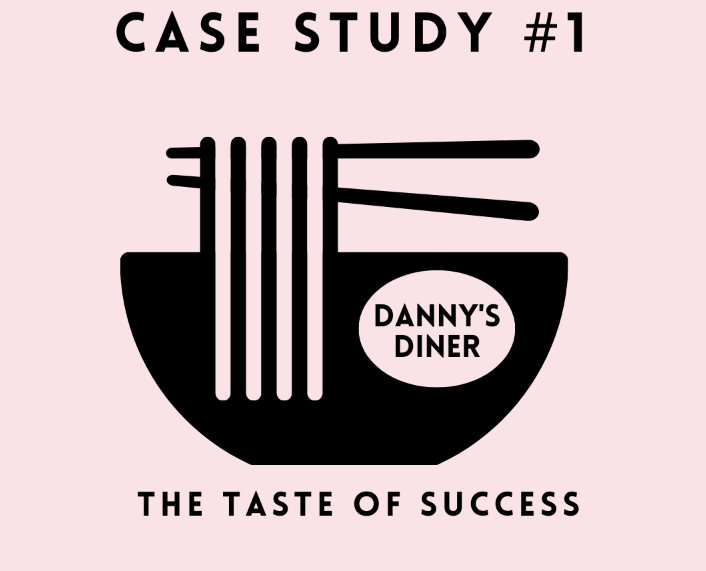

# Case Study 1 - Danny's Dinner

## Introduction
Danny seriously loves Japanese food so in the beginning of 2021, he decides to embark upon a risky venture and opens up a cute little restaurant that sells his 3 favourite foods: sushi, curry and ramen.

Danny’s Diner is in need of your assistance to help the restaurant stay afloat - the restaurant has captured some very basic data from their few months of operation but have no idea how to use their data to help them run the business.

## Problem Statements
Danny wants to use the data to answer a few simple questions about his customers, especially about their visiting patterns, how much money they’ve spent and also which menu items are their favourite. Having this deeper connection with his customers will help him deliver a better and more personalised experience for his loyal customers.

He plans on using these insights to help him decide whether he should expand the existing customer loyalty program - additionally he needs help to generate some basic datasets so his team can easily inspect the data without needing to use SQL.

Danny has provided you with a sample of his overall customer data due to privacy issues - but he hopes that these examples are enough for you to write fully functioning SQL queries to help him answer his questions!

## Case Study Questions

1. What is the total amount each customer spent at the restaurant?
```sql
SELECT s.customer_id, SUM(price) AS total_amount_spend 
FROM sales AS s
JOIN menu AS m
ON s.product_id = m.product_id
GROUP BY s.customer_id
ORDER BY 2 DESC;        
```
2. How many days has each customer visited the restaurant?
```sql
SELECT customer_id, 
    COUNT(DISTINCT(order_date)) AS days_visited 
FROM sales
GROUP BY customer_id
ORDER BY 1
```
3. What was the first item from the menu purchased by each customer?
```sql
WITH CTE AS (
    SELECT s.customer_id,m.product_name,s.order_date,
    DENSE_RANK() OVER(PARTITION BY s.customer_id order by s.order_date) AS ranks
    FROM sales AS s
    JOIN menu AS m
    ON s.product_id = m.product_id
    GROUP BY 1,2,3
    )
SELECT customer_id,product_name
FROM CTE
WHERE ranks=1
```

4. What is the most purchased item on the menu and how many times was it purchased by all customers?
```sql
SELECT m.product_name,COUNT(*)
FROM sales AS s
JOIN menu AS m
ON s.product_id = m.product_id
GROUP BY  m.product_name
ORDER BY 2 DESC
LIMIT 1
```


5. Which item was the most popular for each customer?
```sql
WITH CTE AS (
SELECT customer_id,product_name,item_count,
DENSE_RANK() OVER (PARTITION BY customer_id ORDER BY item_count DESC) AS ranks
FROM(
	SELECT s.customer_id,s.product_id,m.product_name,COUNT(*) AS item_count
	FROM sales s
	JOIN menu m
	ON s.product_id= m.product_id
	GROUP by s.product_id,s.customer_id,m.product_name
	ORDER by s.customer_id,item_count DESC) AS popular_items)
SELECT customer_id,product_name as popular_product
FROM CTE
WHERE ranks = 1
```

6. Which item was purchased first by the customer after they became a member?
```sql
WITH CTE AS (
	SELECT m.customer_id,m.join_date,s.product_id,s.order_date,
	DENSE_RANK() OVER(PARTITION BY m.customer_id ORDER BY s.order_date) as ranks
	FROM members m
	JOIN sales s
	ON m.customer_id  = s.customer_id 
	WHERE s.order_date >= m.join_date -- filtering member and non member customer
	GROUP BY 1,2,3,4
)
SELECT customer_id,m.product_name FROM CTE c
JOIN menu m
ON c.product_id = m.product_id
WHERE ranks = 1
```


7. Which item was purchased just before the customer became a member?
```sql 
SELECT m.customer_id, mi.product_name
FROM members m
	JOIN sales s ON m.customer_id = s.customer_id
	JOIN menu mi ON s.product_id = mi.product_id
WHERE s.order_date < m.join_date
GROUP BY m.customer_id, mi.product_name
ORDER BY m.customer_id;
```
8. What is the total items and amount spent for each member before they became a member?
```sql
SELECT mi.product_name,COUNT(*) AS total_items,
SUM(mi.price) AS total_amount
FROM members m
	JOIN sales s ON m.customer_id = s.customer_id
	JOIN menu mi ON s.product_id = mi.product_id
WHERE s.order_date < m.join_date
GROUP BY 1
ORDER BY mi.product_name DESC
```